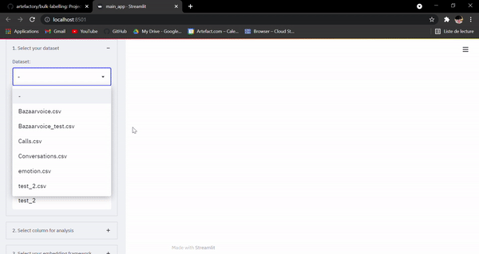
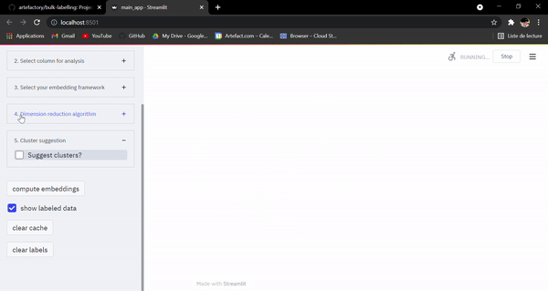

# A tool to help you label massive NLP datasets, quickly.

*This project has been tested with python 3.9*
## Installation

*We highly recommend creating a virtual environment before installing any libraries*.

First clone the repo by shelling:

```git clone git@github.com:artefactory/bulk_labelling.git && cd bulk_labelling/```

to install all the dependencies for the project as well as the sample datasets and necessary models, run:

```make install```

this will install a few sample datasets as well as a couple of models, and the required python packages. it will also create the cache folder in which plotting data will be stored. If you simply want to run the project without the models (this will raise an error when choosing the non-installed models), create a virtual environment and run

```pip install requirements.txt```

At this point, there might be an installation error concerning the *gensim* library, which requires *Microsoft visual C++ 14.0+ to function. this can be downloaded and installed at the following link: https://visualstudio.microsoft.com/fr/visual-cpp-build-tools/.

At this point, reattempt installation if you did not have MVC14.0 installed. otherwise, you're good to go!
## Visualizing your first dataset

to launch the app, simply shell:

```make app```
or 
```streamlit run main_app.py```

this will bring you to the landing page of the app.

### Selecting your dataset

You can either choose between the sample datasets downloaded with ```make install```, or you can upload your own custom dataset via the file uploader. If you so choose, you can name the uploaded dataset so it can be saved into the cached datasets folder for later use.


### Selecting the column you want to cluster

Next, simply select the column you want to label from with the dropdown menu in the following beta expander.




### (Optional) Select the model to be used to compute embeddings

By default, the app computes embeddings with the byte pair language model, a simplistic but rather versatile encoding framework. However, many more models are available with various strengths and weaknesses, and you are free to choose the one you deem most appropriate for your dataset, or play around with them until you get satisfactory results.


### (Optional) Select the dimension reduction framework to use

To visualize many-featured data, dimension reduction is required. Three models are provided to do this, by default TSNE is chosen, but again, you are free to experiment until you get optimal cluster separation.


### Compute embeddings

Once these steps are done, you can simply press the compute embeddings button and wait a short (results may vary) amount of time for your graph to display. Next up, actual labelling and cluster suggestion!


## Actually labelling

### how to label clusters

Now that you have a nice visualization of your data and you're (hopefully) happy with the cluster separation, it's time to do some actual labelling. you can use the incorporated lasso tool in the UI to select a cluster of points you deem worthy to be labeled and input their label in the text input below. Depending on the state of the "show labeled data" checkbox, upon validation you will see the cluster disapear from the viz. If you want to keep it visible, just check the aforementioned checkbox.


Say that you'd like to reset your labelling progress for the whole dataset, or maybe just one cluster. you can do this by clicking the "clear label" button in the sidebar. if you want to clear the cache for computing that might be stochastic in nature and you'd like to re-compute the visualization, you can click the "clear cache" button.

### cluster suggestion

If you're kind of lazy and don't really feel like hovering over a vast amount of points to figure out the structure of your data, we have a small feature that might help: you can ask the app to suggest your own clusters. make a quick choice between which unsupervised clustering algorithm you want, tweak the parameters until you get a satisfactory result, and you're set to label. In the future, we will be implementing more algorithms as well as a potential cluster validation feature that will allow to directly label a cluster with the label suggested by a TFIDF algorithm.


